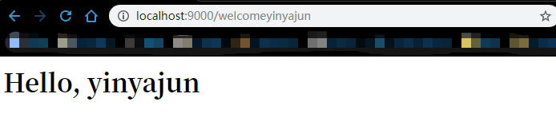
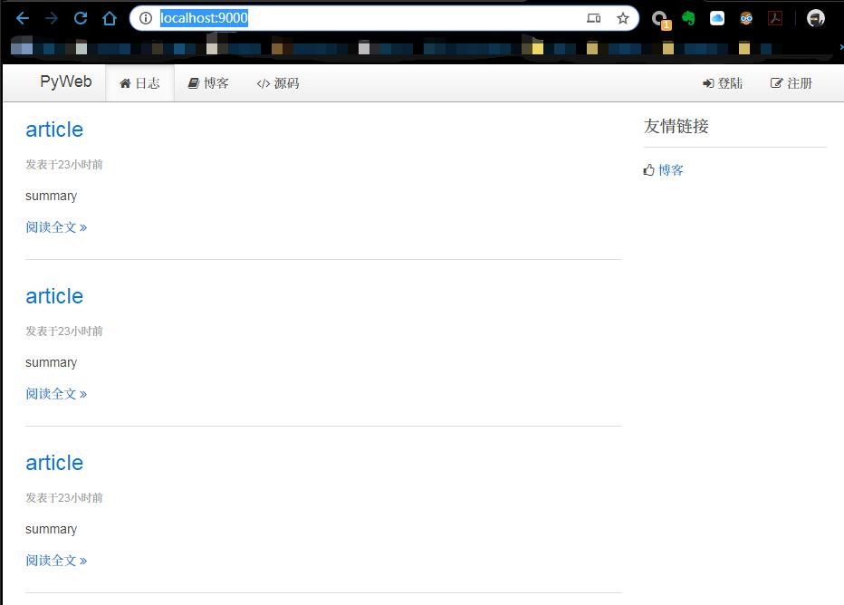

# PyWeb
`PyWeb` is a simple, lightweight, WSGI-compatible web framework. It is a translation of `transwarp` part in 
[awesome-python-webapp](https://github.com/michaelliao/awesome-python-webapp/tree/release) by [michaelliao](https://github.com/michaelliao).
His [tutorial](https://www.liaoxuefeng.com/wiki/897692888725344/945671276329568) helps me a lot!

## Modification
* Support Python3, while original package only support Python2.
* Code arrangement
* Use `tornado.WSGIcontainer` as WSGI Server.

## Features
* Simple and light.
* WSGI compatible
* Support MVC
* Support add module

## Usage
In `tests`, there is an example app.

### 1. Start Application
```python
import web.web as web

# init WSGIApplication
app = web.WSGIApplication(dir_path(__file__))

# init template engine
template_engine = web.Jinja2TemplateEngine(os.path.join(dir_path(__file__), 'templates'))
template_engine.add_filter('datetime', datetime_filter)
app.template_engine = template_engine

@web.get('/welcome:user')
def app_dynamic_route_test(user):
    return to_byte('<h1>Hello, %s</h1>' % user)
    
    
@web.view('blogs.html')
@web.get('/')
def app_view_test():
    blogs = [Blog(3, 10, 'yyj', 'article', 'summary', 'cotent', 1577167235)] * 5
    user = Users('nike', 'fsafe')
    return dict(users=user, blogs=blogs)

if __name__ == '__main__':
    app.add_url(app_dynamic_route_test)
    app.add_url(app_view_test)
    # start server on Port 9000.
    app.tornado_run(9000)
```
There will be logs:
```bash
2019-12-25 13:15:32	web.py	INFO	Add route: Route(dynamic,GET,path=/welcome:user)
2019-12-25 13:15:32	web.py	INFO	Add route: Route(static,GET,path=/)
```
### 2. Test route
`http://localhost:9000/welcomeyinyajun`



```bash
[I 191225 13:18:29 wsgi:354] 200 GET /welcomeyinyajun (127.0.0.1) 1.00ms
```

### 3. Test template
`http://localhost:9000/`


```bash
[I 191225 13:21:56 wsgi:354] 200 GET / (127.0.0.1) 22.50ms
[I 191225 13:21:56 wsgi:354] 200 GET /static/css/uikit.min.css (127.0.0.1) 0.50ms
[I 191225 13:21:56 wsgi:354] 200 GET /static/css/uikit.gradient.min.css (127.0.0.1) 1.00ms
[I 191225 13:21:56 wsgi:354] 200 GET /static/css/awesome.css (127.0.0.1) 0.50ms
[I 191225 13:21:56 wsgi:354] 200 GET /static/js/jquery.min.js (127.0.0.1) 1.00ms
[I 191225 13:21:56 wsgi:354] 200 GET /static/js/md5.js (127.0.0.1) 0.50ms
[I 191225 13:21:56 wsgi:354] 200 GET /static/js/uikit.min.js (127.0.0.1) 0.50ms
[I 191225 13:21:56 wsgi:354] 200 GET /static/js/sticky.min.js (127.0.0.1) 1.50ms
[I 191225 13:21:56 wsgi:354] 200 GET /static/js/vue.min.js (127.0.0.1) 0.50ms
[I 191225 13:21:56 wsgi:354] 200 GET /static/js/awesome.js (127.0.0.1) 4.00ms
[I 191225 13:21:56 wsgi:354] 200 GET /static/fonts/fontawesome-webfont.woff (127.0.0.1) 1.00ms
```